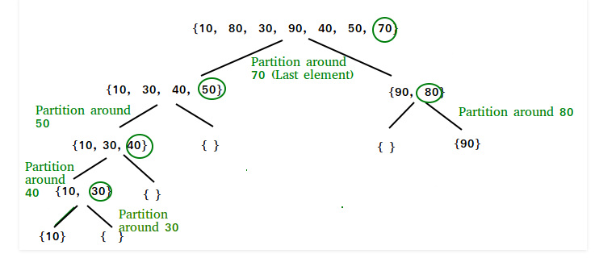

# Quick Sort Algorithm
# What is quick sort algorithm ?
Quick Sort Algorithm picks an element as pivot and partitions the given array around the picked pivot
# Example:

# How did it ?
 I wanted to make an algorithm in python so I made a quick research what i can do if this is my first algorithm project and I found the Quick-Sort-Algorithm. I started reading abaout the logic behind it, after that i saw some youtube videos and I started building the algorithm.
 
# What I learnt ?
- I learnt more or less how to think while building algoritm
- I learnt what is Quick-Sort-Algorithm
- I trained my python skills
